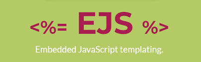

#  authentication-flows-js-app

This project is a web-app, and uses the "authentication-flows-js" module. 
The "authentication-flows-js" project is [here](https://github.com/OhadR/authentication-flows-js).

[authentication-flows-js](https://github.com/OhadR/authentication-flows-js)

[authentication-flows-js on npm](https://www.npmjs.com/package/authentication-flows-js)

## required environment variables (for hosting-app and tests)

    DEBUG=*,-follow-redirects -express:* -body-parser:*
    emailSender
    smtpServer
    smtpPort
    emailServerUser
    emailServerPass

loading on windows the env file:

    for /F %A in (.env) do SET %A

## `body-parser`

According to https://www.digitalocean.com/community/tutorials/use-expressjs-to-get-url-and-post-parameters, the client-app
MUST use body-parser in order to be able to parse the body params.
Thus, the `authentication-flows-js` can use:

        debug(`createAccount requestBody ${req.body}`);

## dependencies

* `authentication-flows-js`  - to implement all authentication flows.
* `authentication-flows-js-gae-datastore` - authentication-flows' implementation for Google AppEngine storage.
* `dotenv`  - read env-variables from `.env` file.
* `ejs`  - to serve the HTML pages from the backend.

## Google AppEngine

this app is also deployed on Google's PaaS, AppEngine. You can find it here: https://auth-flows-js-demo.appspot.com

### deploy

from Google Cloud SDK Shell:

    gcloud app deploy

